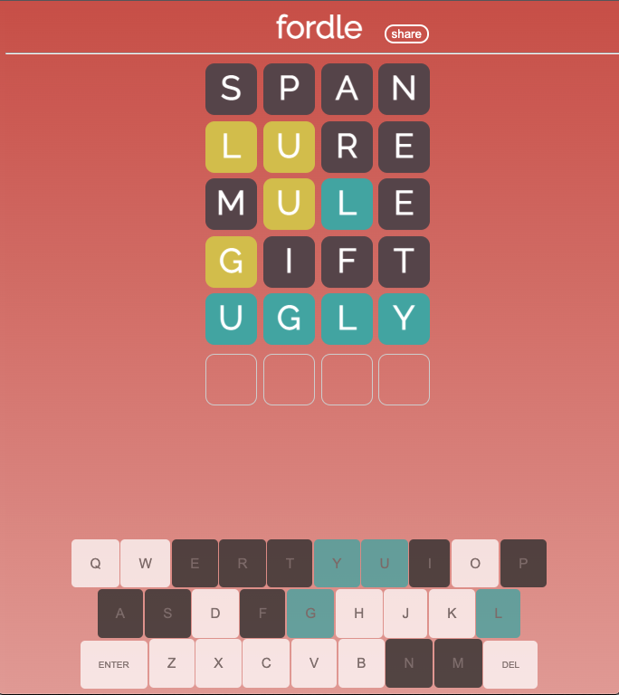

 

  

  <h3 align="center">Fordle</h3>

  

    A simple web game based on popular game "wordle" - this time using just 4 letter words!
     
     
    <a href="https://wrfhowell.github.io/fordle/">Play it yourself!</a>
  

<!-- ABOUT THE PROJECT -->
## About Fordle
I wanted to make a word game similar to "Wordle" for my friends and family to play. I decided to use four letter words instead of five letter words in the original game.
I also created my own UI to give it a different feel then the original game.

  
 

I used javascript and css to create the game with its own animations, sharing feature, local storage and automatic word update each day. The hardest part was ensuring
that the game worked on both computer and all mobile phones. You can play it yourself at wrfhowell.github.io/fordle.

### Built With

* Javascript
* HTML
* CSS
* ... I might end up changing the game to use react to clean it up

(<a href="#top">back to top</a>)

